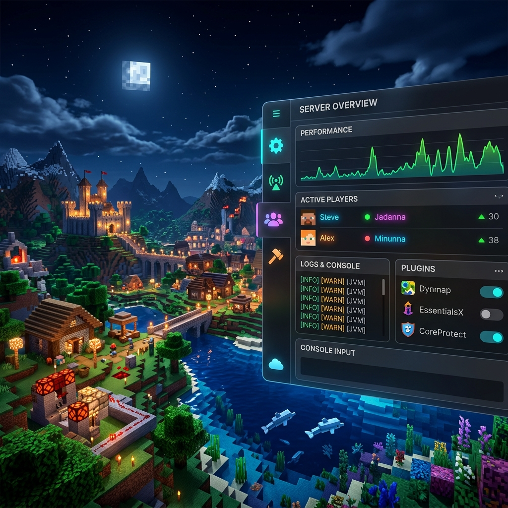

# 🎮 Minecraft Server Manager




Gestor automatizado para desplegar y administrar servidores de **Minecraft Java (PaperMC)** y **Minecraft Bedrock** con soporte nativo para **Cross-play**.

---

## 🚀 Características Principales

*   **Instalación One-Click**: Descarga y configura automáticamente PaperMC y Bedrock Server.
*   **Soporte Cross-play**: Configurado con Geyser y Floodgate para que jugadores de consola/móvil se unan al servidor Java.
*   **Detección Inteligente**: El script `setup.js` verifica tu versión de Java y te guía si necesitas una actualización.
*   **Menú Interactivo**: Un solo archivo `.bat` para lanzar cualquiera de los dos servidores.

---

## ⚙️ Requisitos del Sistema

*   **S.O.**: Windows 10 / 11
*   **Entorno**: [Git](https://git-scm.com/downloads) y [Node.js](https://nodejs.org/) instalados.
*   **Java**: 
    *   **Java 21/25** (Recomendado para las versiones más recientes).
    *   *Nota: El instalador detectará automáticamente qué versión necesitas según la versión de Minecraft.*
*   **Red**: Puertos `25565` (Java) y `19132` (Bedrock) abiertos para acceso externo.

---

## 📂 Estructura del Proyecto

```text
servidor-mc/
├── java/               # Servidor PaperMC
│   ├── plugins/        # GeyserMC, Floodgate, etc.
│   └── start.bat       # Script de inicio (8GB RAM por defecto)
├── bedrock/            # Servidor Oficial Bedrock
│   └── start.bat       # Script de inicio rápido
├── setup.js            # Cerebro de la instalación
└── start.bat           # Menú principal de acceso
```

---

## 🛠️ Instalación y Uso

### 1. Clonar y Configurar
Si es tu primera vez, abre una terminal en la carpeta raíz y ejecuta:

```powershell
git clone https://github.com/Shoropio/servidor-mc.git
```

```powershell
cd servidor-mc
```

```powershell
node setup.js
```
*Este script descargará los archivos necesarios, aceptará la EULA y configurará los límites de memoria.*

### 2. Iniciar el Servidor
Solo necesitas ejecutar el archivo principal:

```powershell
./start.bat
```
Selecciona `1` para Java o `2` para Bedrock. ¡Y listo!

---

## ☕ Configuración Avanzada

### Memoria RAM (Java)
Por defecto, el servidor Java está configurado con **8GB de RAM**. Puedes cambiar esto editando `java/start.bat`:
```batch
java -Xms4G -Xmx4G -jar server.jar nogui
```

### Cross-play (Geyser)
Los jugadores de Bedrock pueden entrar usando la IP de tu PC y el puerto `19132`. No necesitan una cuenta de Java gracias a Floodgate.

---

## ❓ Solución de Problemas

**¿Error de versión de Java?**
Si `setup.js` indica que tu versión es insuficiente, descarga la última versión [Temurin (Adoptium)](https://adoptium.net/es/temurin/releases).

**¿No pueden entrar desde fuera?**
Asegúrate de haber hecho "Port Forwarding" en tu router para los puertos `25565` (TCP) y `19132` (UDP).

---

## 📜 Licencia y Créditos

Este proyecto está bajo la licencia **MIT**. Desarrollado por **Shoropio Corporation**.

---
> [!TIP]
> Mantén siempre una copia de seguridad de la carpeta `world` antes de realizar actualizaciones mayores con `setup.js`.
